# Домашнее задание к занятию «Введение в Terraform»

### Цели задания

1. Установить и настроить Terrafrom.
2. Научиться использовать готовый код.

------

### Чек-лист готовности к домашнему заданию

1. Скачайте и установите **Terraform** версии >=1.12.0 . Приложите скриншот вывода команды ```terraform --version```.
2. Скачайте на свой ПК этот git-репозиторий. Исходный код для выполнения задания расположен в директории **01/src**.
3. Убедитесь, что в вашей ОС установлен docker.

Скриншоты.  

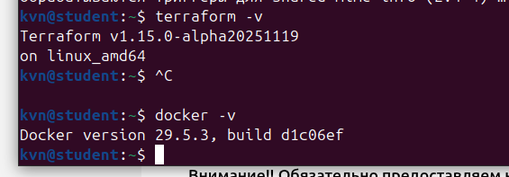  

------

### Инструменты и дополнительные материалы, которые пригодятся для выполнения задания

1. Репозиторий с ссылкой на зеркало для установки и настройки Terraform: [ссылка](https://github.com/netology-code/devops-materials).
2. Установка docker: [ссылка](https://docs.docker.com/engine/install/ubuntu/). 
------
### Внимание!! Обязательно предоставляем на проверку получившийся код в виде ссылки на ваш github-репозиторий!
------

### Задание 1

1. Перейдите в каталог [**src**](https://github.com/netology-code/ter-homeworks/tree/main/01/src). Скачайте все необходимые зависимости, использованные в проекте. 
2. Изучите файл **.gitignore**. В каком terraform-файле, согласно этому .gitignore, допустимо сохранить личную, секретную информацию?(логины,пароли,ключи,токены итд)
3. Выполните код проекта. Найдите  в state-файле секретное содержимое созданного ресурса **random_password**, пришлите в качестве ответа конкретный ключ и его значение.
4. Раскомментируйте блок кода, примерно расположенный на строчках 29–42 файла **main.tf**.
Выполните команду ```terraform validate```. Объясните, в чём заключаются намеренно допущенные ошибки. Исправьте их.
5. Выполните код. В качестве ответа приложите: исправленный фрагмент кода и вывод команды ```docker ps```.
6. Замените имя docker-контейнера в блоке кода на ```hello_world```. Не перепутайте имя контейнера и имя образа. Мы всё ещё продолжаем использовать name = "nginx:latest". Выполните команду ```terraform apply -auto-approve```.
Объясните своими словами, в чём может быть опасность применения ключа  ```-auto-approve```. Догадайтесь или нагуглите зачем может пригодиться данный ключ? В качестве ответа дополнительно приложите вывод команды ```docker ps```.
8. Уничтожьте созданные ресурсы с помощью **terraform**. Убедитесь, что все ресурсы удалены. Приложите содержимое файла **terraform.tfstate**. 
9. Объясните, почему при этом не был удалён docker-образ **nginx:latest**. Ответ **ОБЯЗАТЕЛЬНО НАЙДИТЕ В ПРЕДОСТАВЛЕННОМ КОДЕ**, а затем **ОБЯЗАТЕЛЬНО ПОДКРЕПИТЕ** строчкой из документации [**terraform провайдера docker**](https://library.tf/providers/kreuzwerker/docker/latest).  (ищите в классификаторе resource docker_image )

<span style="color:red"> 

## Ответ  
<span style="color:black">


1) Клонируем репозиторий с каталогом src на локальную машину. Создаем подкаталог terraform в проекте и переносим файл main.tf в него. Так как Terraform уже установлен на локальной машине файл .terraformrc уже есть в домашнем каталоге.   
2) Запускаем terraform init.  Ok.
3) Изучаем файл .gitignore. Личную секретную информацию допустимо хранить в файле personal.auto.tfvars — он явно помечен как отдельное хранилище секретных переменных и добавлен в игнор.
4) Выполняем код проекта ***terraform plan*** и ***terraform apply***. Просматриваем файл ***terraform.tfstate***. Ищем значение пароля в формате ключ=значение. Он он находится в полу result ресурса ***random_password.random_string***. Выделим его на скриншоте.     
5) Раскомментируем блок кода про докер и выполним команду ***terraform validate***.  Terraform сообщил о том, что у ресурса docker_image нет имени  ресурса, а у ресурса docker_container имя начинается с цифры. А также внутри ресурса, обявляющего оконтейнер есть ссылка на несуществующий ресурс   ***name  = "example_${random_password.random_string_FAKE.resulT}"***. Так как объявлен только ***resource "random_password" "random_string"***, то обращение должно быть такм  ***name  = "example_${random_password.random_string.result}"***.   
6) Исправляем. Запускаем команду ***terraform validate***. Ok. Запускаем команду ***terraform apply***. Смотрим список запущенных контейнеров ***docker ps***.  Видим наш ***74fc8c5fe504   06aa3d7be10b   "/docker-entrypoint.…"   About a minute ago   Up About a minute   0.0.0.0:9090->80/tcp       example_VaGqhb0dXfxC3qjv***.  
7) Меняем имя контейнера на ***hello_world***.  
8) Создаем новый контейнер командой ***terraform apply -auto-approve***.  Флаг ***-auto-approve*** у команды ***terraform apply*** отключает интерактивное подтверждение перед применением плана и сразу выполняет все изменения, которые Terraform вычислил. Можно случайно уничтожить или изменить критичные ресурсы (БД, прод-кластеры, сетевую инфраструктуру), потому что Terraform не покажет план для подтверждения. Ошибка в коде будет сразу применена, что может привести к потере данных.  
9) Удаляем данные командой ***terraform destroy -auto-approve*** .  
10) Не был удалён docker-образ nginx:latest потому что в клоде есть аргумент ***keep_locally = true***. Этот флаг отвечает за то, будет ли провайдер пытаться удалять образ из локального Docker при уничтожении ресурса. В нашем случае terraform должен оставить образ nginx:latest локально даже после ***terraform destroy***.   


Файлы.    
<a href="./terraform/main.tf" target="_blank"> terraform.main </a>  


Скриншоты.  

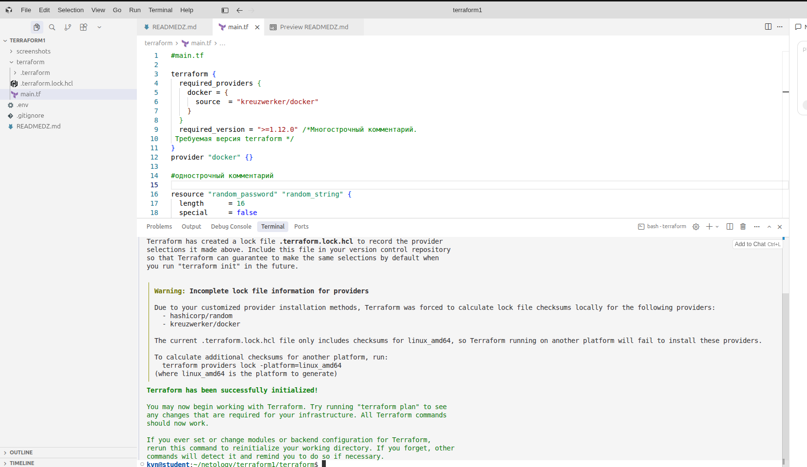  
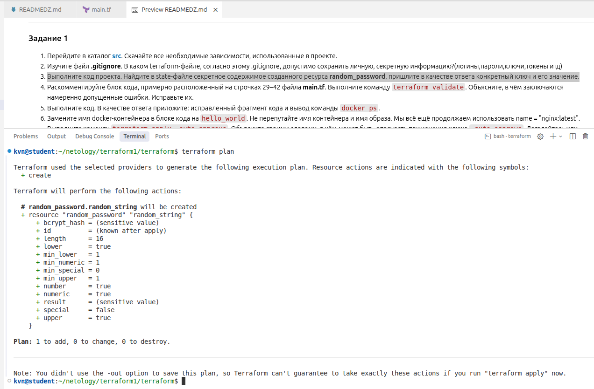  
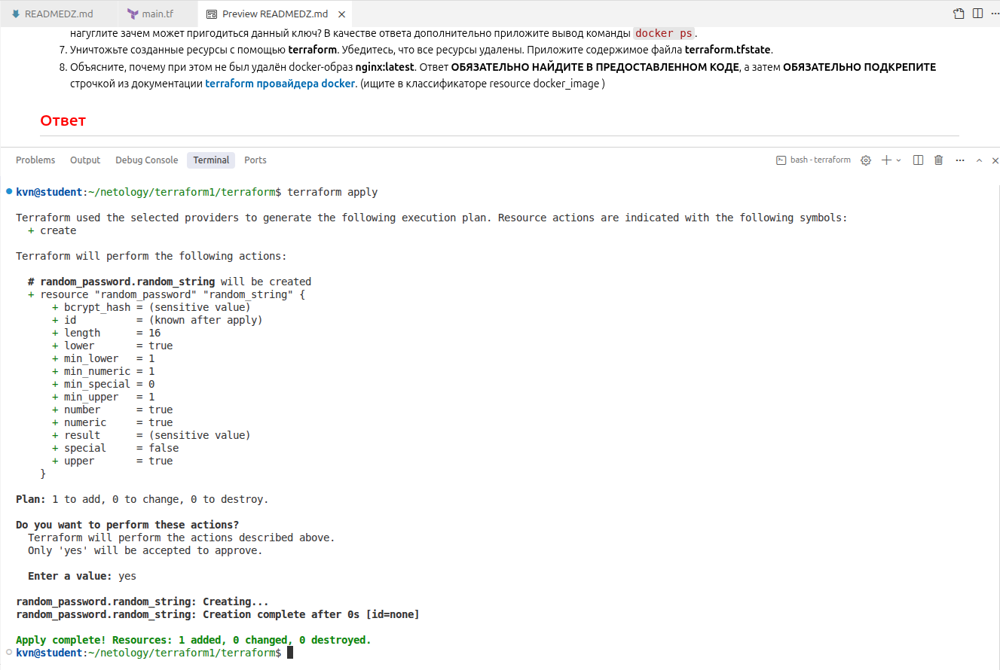  
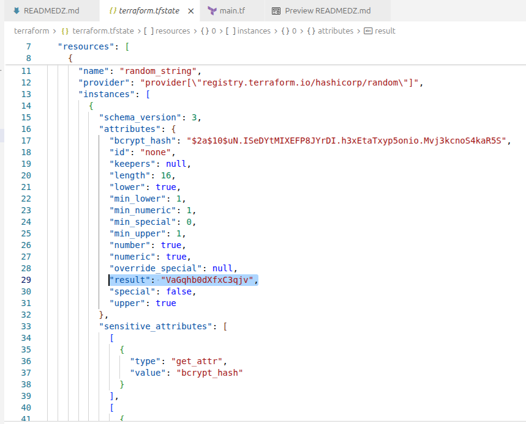  
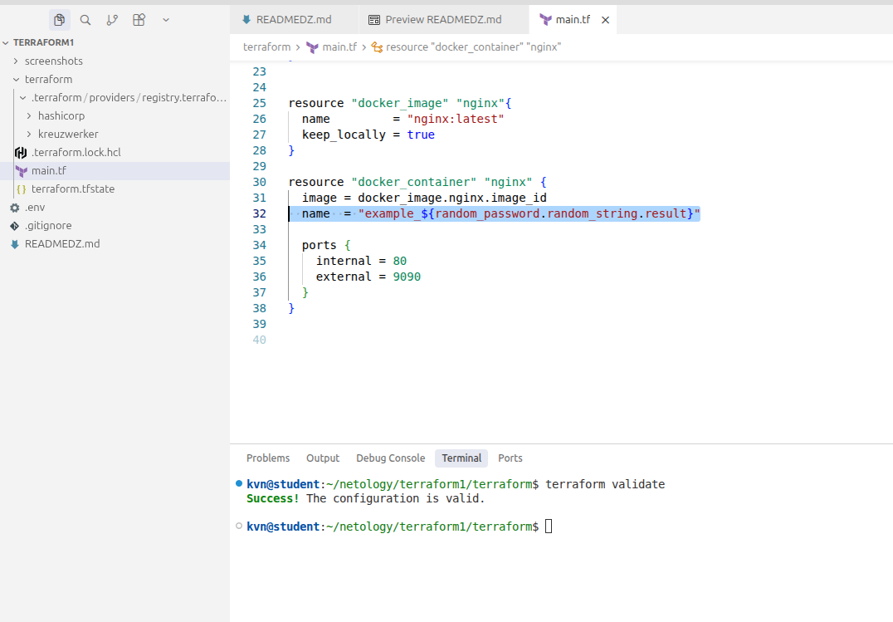  
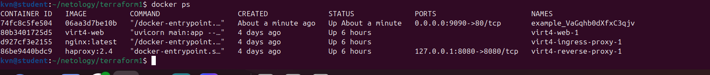  
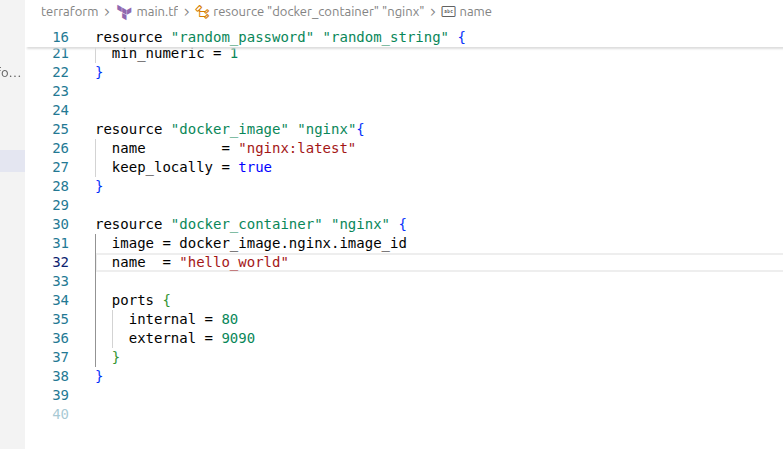  
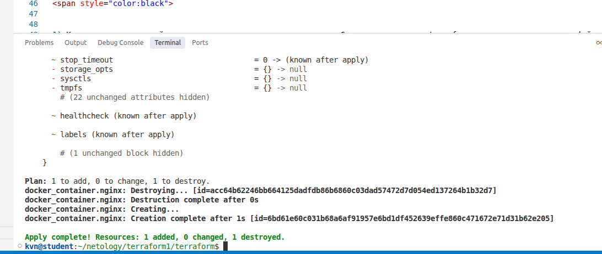  
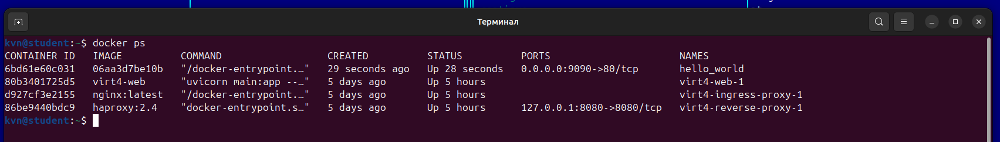  
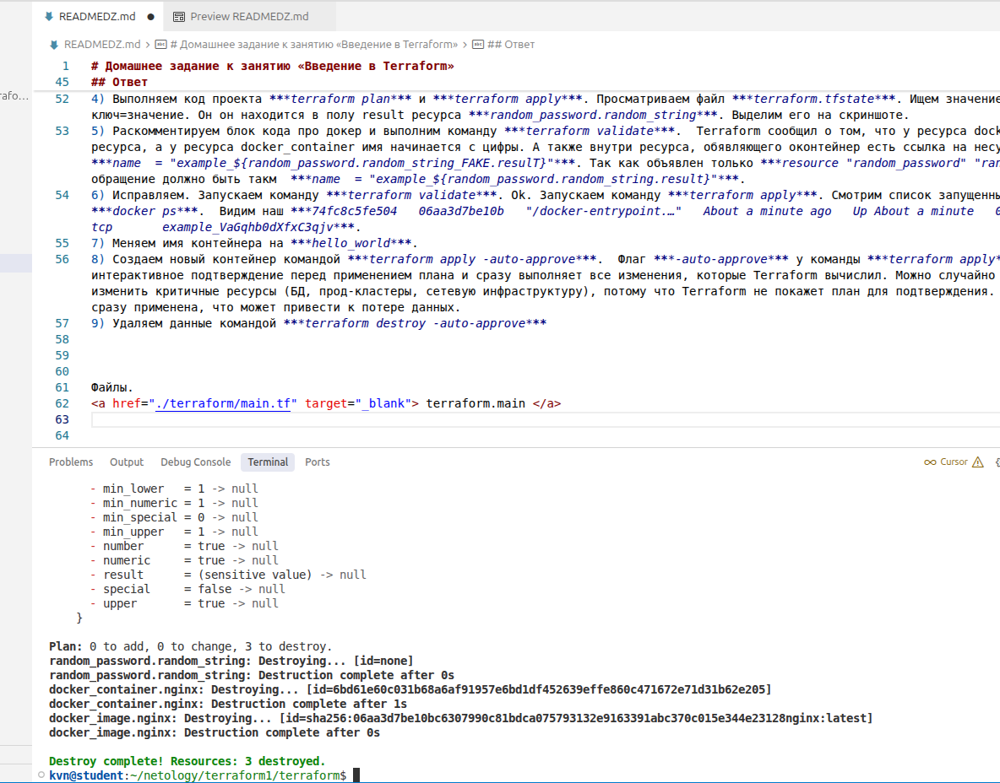  
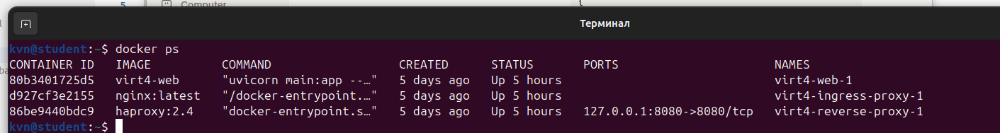  
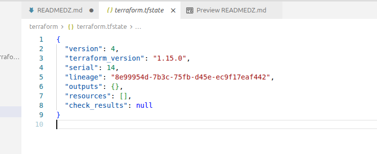  

------

## Дополнительное задание (со звёздочкой*)

**Настоятельно рекомендуем выполнять все задания со звёздочкой.** Они помогут глубже разобраться в материале.   
Задания со звёздочкой дополнительные, не обязательные к выполнению и никак не повлияют на получение вами зачёта по этому домашнему заданию. 

### Задание 2*

1. Создайте в облаке ВМ. Сделайте это через web-консоль, чтобы не слить по незнанию токен от облака в github(это тема следующей лекции). Если хотите - попробуйте сделать это через terraform, прочитав документацию yandex cloud. Используйте файл ```personal.auto.tfvars``` и гитигнор или иной, безопасный способ передачи токена!
2. Подключитесь к ВМ по ssh и установите стек docker.
3. Найдите в документации docker provider способ настроить подключение terraform на вашей рабочей станции к remote docker context вашей ВМ через ssh.
4. Используя terraform и  remote docker context, скачайте и запустите на вашей ВМ контейнер ```mysql:8``` на порту ```127.0.0.1:3306```, передайте ENV-переменные. Сгенерируйте разные пароли через random_password и передайте их в контейнер, используя интерполяцию из примера с nginx.(```name  = "example_${random_password.random_string.result}"```  , двойные кавычки и фигурные скобки обязательны!) 
```
    environment:
      - "MYSQL_ROOT_PASSWORD=${...}"
      - MYSQL_DATABASE=wordpress
      - MYSQL_USER=wordpress
      - "MYSQL_PASSWORD=${...}"
      - MYSQL_ROOT_HOST="%"
```

6. Зайдите на вашу ВМ , подключитесь к контейнеру и проверьте наличие секретных env-переменных с помощью команды ```env```. Запишите ваш финальный код в репозиторий.

<span style="color:red"> 

## Ответ  
<span style="color:black">


1) 
2)

Файлы.    
<a href="./Dockerfile.python" target="_blank"> Dockerfile.python </a>  
<a href="./.dockerignore" target="_blank"> .dockerignore </a>  
<a href="./.gitignore" target="_blank"> .gitignore </a>  
<a href="./compose.yaml" target="_blank"> compose.yaml </a>  
<a href="./script.sh" target="_blank"> script.sh </a>  

Скриншоты.  

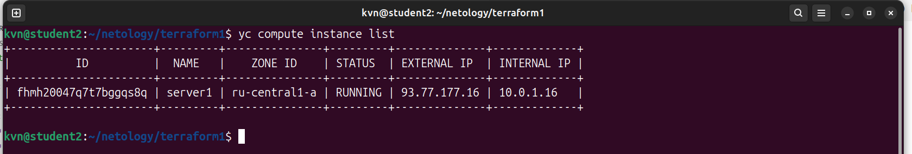  
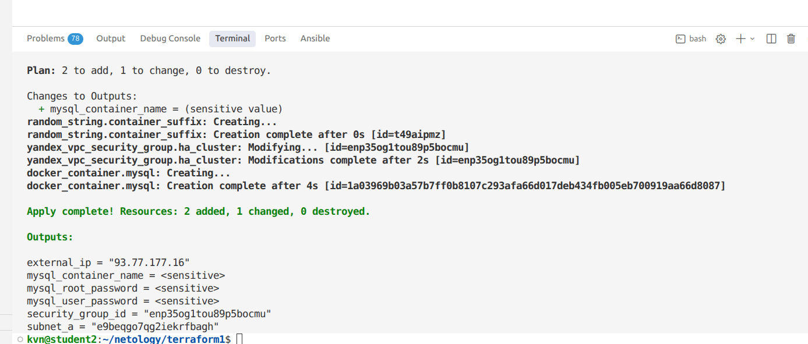  
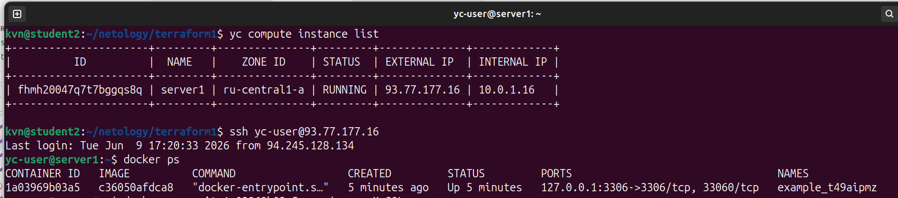  
  


### Задание 3*
1. Установите [opentofu](https://opentofu.org/)(fork terraform с лицензией Mozilla Public License, version 2.0) любой версии
2. Попробуйте выполнить тот же код с помощью ```tofu apply```, а не terraform apply.

<span style="color:red"> 

## Ответ  
<span style="color:black">

1) 
2)


Файлы.    
<a href="./Dockerfile.python" target="_blank"> Dockerfile.python </a>  
<a href="./.dockerignore" target="_blank"> .dockerignore </a>  
<a href="./.gitignore" target="_blank"> .gitignore </a>  
<a href="./compose.yaml" target="_blank"> compose.yaml </a>  
<a href="./script.sh" target="_blank"> script.sh </a>  


Скриншоты.  

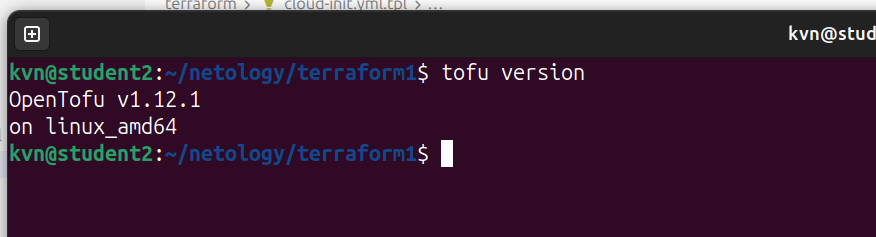  
![Задание 3. Скриншот 2(screenshots/scr3_2.png)  
![Задание 3. Скриншот 3(screenshots/scr3_3.png)  
![Задание 3. Скриншот 4(screenshots/scr3_4.png)  

  
Файлы.    
<a href="./Dockerfile.python" target="_blank"> Dockerfile.python </a>  
<a href="./.dockerignore" target="_blank"> .dockerignore </a>  
<a href="./.gitignore" target="_blank"> .gitignore </a>  
<a href="./compose.yaml" target="_blank"> compose.yaml </a>  
<a href="./script.sh" target="_blank"> script.sh </a>  

Скриншоты.  

  
  
  
  


